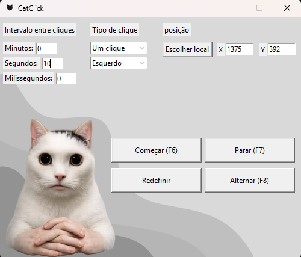

🐱 CatClick

Aplicação de autoclick desenvolvida em Python com interface usandio Tkinter.

📌 Funcionalidades

-Clique automático na tela
-Configurações de intervalo (minutos, segundos, milissegundos)
-Interface simples
-Controle por teclado

⌨️ Atalhos

-F6 → Iniciar
-F7 → Parar
-F8 → Alternar

🛠️ Tecnologias utilizadas

-Python
-Tkinter
-PyAutoGUI
-Keyboard
-Pynput

🚀 Como executar o projeto

1. Clonar o repositório
git clone https://github.com/uellpng-tech/catclick.git

2. Entrar na pasta
cd catclick

3. Criar ambiente virtual
python -m venv venv

4. Ativar ambiente
Windows: venv\Scripts\activate

5. Instalar dependências
pip install -r requirements.txt

6. Executar o programa 
python main.py

📁 Estrutura do projeto
catclick/
│
├── main.py
├── requirements.txt
├── .gitignore
├── README.md
└── imagens/

📸 Preview

📄 Licença

Este projeto é apenas para fins educacionais.