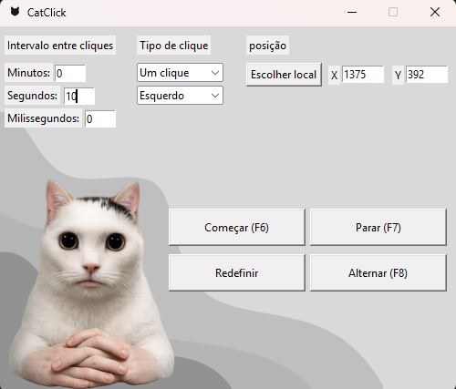

# CatClick

O Catclick é um software de autoclick. O catclick é um software para Windows destinado a automatizar cliques para facilitar tarefas repetitivas, o software é bem intuitivo e possui uma interface simples possibilitando com que seja mais fácil de utilizar, além de sua funcionalidade de cliques automáticos, o software conta com atalhos facilitando o uso, localização através do mouse e intervalos editaveis. 

## Funcionalidades  

- Clique automático na tela
- Configurações de intervalo (minutos, segundos, milissegundos)
- Interface simples
- Controle por teclado

## Blibliotecas utilizadas

- Tkinter
- PyAutoGUI
- Keyboard
- Pynput

Interface 

## Estrutura

A estrutura do projeto é bem simples. O projeto conta com as imagens necessárias para o funcionamento da interface gráfica, o arquivo "main" que é o código fonte do projeto, as blibliotecas necessárias que são baixadas pelo usuário através do "requirements.txt" e o "README.md" que é a descrição e o guia do software. 

## Instalação

1. Clone o repositório https://github.com/uellpng-tech/catclick

2. Acesse a pasta do projeto "catclick"

3. Crie um ambiente virtual python3 -m venv venv (opcional) 

4. Ative o ambiente virtual "venv\Scripts\activate"

5. Instale as dependências "pip install -r requirements.txt"

6. Execute o programa "python main.py"